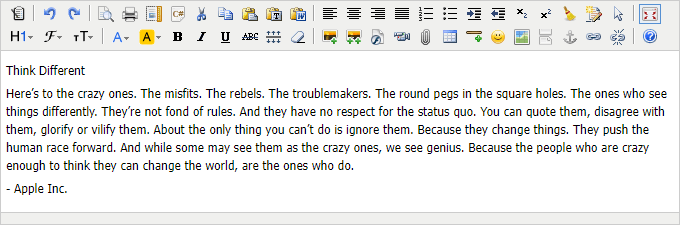
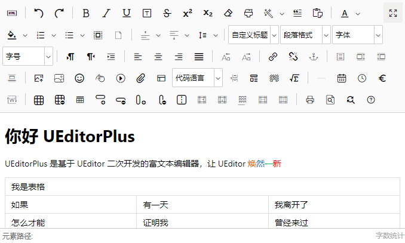
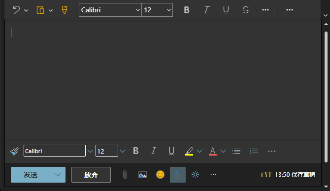
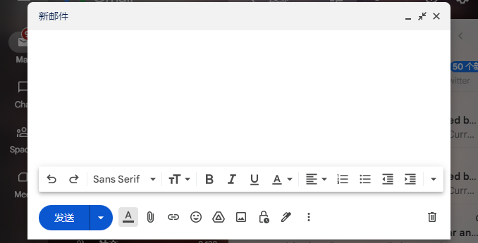

# 做个编辑器

## 你遇到了多少“坑” ？

<p class="fs-20" style="margin-top:5em">作者：<span class="fs-30">徐沛文</span> <span class="fs-20 op-5">(邮件产品部前端)</span></p>


- 1. 编辑器
   - 1.1 类型
   - 1.2 竞品对比
   - 1.3 框架选型
- 2. 功能改造
   - 2.1 格式刷
   - 2.2 表格
   - 2.3 文本操作
   - 2.4 粘贴
- 3. 总结


---


## 编辑器类型


<ul>
    <li><b>纯文本编辑器</b></li>
    <li class="f-mgt f-mgb fs-30 op-5 f-db">TextArea</li>
    <li><b>原生 HTML 编辑器</b></li>
    <li class="f-mgt f-mgb fs-30 op-5 f-db">ContentEditable</li>
    <li><b>独立实现光标和排版的 HTML 编辑器</b></li>
    <li class="f-mgt f-mgb fs-30 op-5 f-db">Microsoft Office、WPS、Google 文档</li>
  </ul>


<ul>
  <li><b>文本编辑器</b> (IDE)</li>
  <li class="f-mgt f-mgb fs-30 op-5 f-db">具有源码级别编辑、代码着色、自动补全和调试功能</li>
  <li><b>WYSIWYG 编辑器</b></li>
  <li class="f-mgt f-mgb fs-30 op-5 f-db">What you see is what you get，所见即所得</li>
</ul>


## WYSIWYG 编辑器


|  KindEditor  | UEditor Plus |
|:------------:|:------------:|
|  |  |


| Outlook (web) |    Gmail     |
|:-------------:|:------------:|
|   |  |


---


## 竞品分析


<style>
  .compared-table th:nth-child(2) { width: 500px }
  .compared-table-1 th:nth-child(3) { width: 400px }
</style>


|   类别    | 功能                            | Coremail | 网易灵犀  | Outlook |
|:-------:|:------------------------------|:--------:|:-----:|:-------:|
| 撤回 / 重做 | 撤回                            |  **●**   | **●** |  **●**  |
|         | 重做                            |  **●**   | **●** |  **●**  |
|         | 快捷键（Ctrl+Z，Ctrl+Y）            |  **●**   | **●** |  **●**  |
|  删除格式   | 删除单个文字格式(文本/表格中的文字格式）         |  **●**   | **●** |  **●**  |
|         | 删除组合格式（包括有格式+无格式组合）           |  **●**   | **●** |  **●**  |
|         | 删除段落格式（行距，对齐方式，编号，缩进）	        |  **●**   | **●** |  **●**  |
|   格式刷   | 刷文字(文本/表格中的文字格式）	             |  **●**   | **●** |  **●**  |
|         | 刷段落格式（行距，缩进，对齐方式，编号）	         |  **●**   | **●** |  **●**  |
|         | 双击格式刷进行多处格式刷	                 |  **●**   | **●** |  **●**  |
|   格式刷   | 刷文字(文本/表格中的文字格式）	             |  **●**   | **●** |  **●**  |
|   字体    | 初始值（注意收发信设置-默认字体设置）	          |  **●**   | **●** |  **●**  |
|         | 选择字体后字体框显示相应字体                |  **●**   | **●** |  **●**  |
|         | 支持更换字体（选择字体，不选择字体，选择多种字体的段落）	 |  **●**   | **●** |  **●**  |

<ul class="f-mgt fs-16 ls-none">
  <li><span class="f-mgr f-dbi fs-24" style="width:20px">●</span> <span class="f-vam op-5">支持</span></li>
  <li><span class="f-mgr f-dbi fs-24" style="width:20px">○</span> <span class="f-vam op-5">部分支持</span></li>
  <li><span class="f-mgr f-dbi fs-24" style="width:20px">/</span> <span class="f-vam op-5">不支持</span></li>
</ul>


|  类别  | 功能                           | Coremail | 网易灵犀  | Outlook |
|:----:|:-----------------------------|:--------:|:-----:|:-------:|
| 文字大小 | 初始值（注意收发信设置-默认字体设置）          |  **●**   | **●** |  **●**  |	
|      | 文字大小下拉列表                     |  **●**   | **●** |  **●**  |
|      | 选择文字后文字大小框显示相应字体大小           |  **●**   | **●** |  **●**  |
|      | 更换文字大小（选择文字，未选择字体，选择多种文字的段落） |  **●**   | **●** |  **●**  |
|  粗体  | 选择字体（未加粗，未加粗+加粗，加粗+未加粗，加粗）   |  **●**   | **●** |  **●**  |	
|      | 未选择字体后加粗输入文字，跨行              |  **●**   | **●** |  **●**  |
|      | 快捷键（Ctrl+B）	                 |  **●**   | **●** |  **●**  |	
|  斜体  | 选择字体（未倾斜，未倾斜+倾斜，倾斜+未倾斜，倾斜）   |  **●**   | **●** |  **●**  |	
|      | 未选择字体后设置斜体输入文字，跨行            |  **●**   | **●** |  **●**  |
|      | 快捷键（Ctrl+I）	                 |  **●**   | **●** |  **●**  |

<ul class="f-mgt fs-16 ls-none">
  <li><span class="f-mgr f-dbi fs-24" style="width:20px">●</span> <span class="f-vam op-5">支持</span></li>
  <li><span class="f-mgr f-dbi fs-24" style="width:20px">○</span> <span class="f-vam op-5">部分支持</span></li>
  <li><span class="f-mgr f-dbi fs-24" style="width:20px">/</span> <span class="f-vam op-5">不支持</span></li>
</ul>


|  类别  | 功能                                                    | Coremail | 网易灵犀  | Outlook |
|:----:|:------------------------------------------------------|:--------:|:-----:|:-------:|
| 下划线  | 选择字体（没有下划线，没有下划线+下划线，下划线+没有下划线，下划线）	                  |  **●**   | **●** |  **●**  |
|      | 未选择字体后设置下划线输入文字，跨行                                    |  **●**   | **●** |  **●**  |
|      | 快捷键（Ctrl+U）	                                          |  **●**   | **●** |  **●**  |
| 删除线  | 选择字体（未倾斜，未倾斜+倾斜，倾斜+未倾斜，倾斜）                            |  **●**   | **●** |  **●**  |
|      | 未选择字体后设置斜体输入文字，跨行                                     |  **●**   | **●** |  **●**  |
| 上标下标 | 选择字体（无上标，无上标+有上标，有上标+无上标，有上标），下标情况一致                  |  **●**   | **/** |  **●**  |	
|      | 未选择字体后设置上标/下标输入文字，跨行                                  |  **●**   | **/** |  **●**  |
| 文字颜色 | 选择字体（无上标，无上标+有上标，有上标+无上标，有上标），下标情况一致                  |  **●**   | **●** |  **●**  |
|      | 颜色悬浮提示                                                |  **●**   | **●** |  **●**  |
|      | 未选择字体后选择颜色，换行                                         |  **●**   | **●** |  **●**  |
|      | 字体颜色更改（无颜色-设置颜色1，无颜色+颜色1-设置颜色1，颜色2，颜色1+无颜色，设置颜色1，颜色2） |  **●**   | **●** |  **●**  |

<ul class="f-mgt fs-16 ls-none">
  <li><span class="f-mgr f-dbi fs-24" style="width:20px">●</span> <span class="f-vam op-5">支持</span></li>
  <li><span class="f-mgr f-dbi fs-24" style="width:20px">○</span> <span class="f-vam op-5">部分支持</span></li>
  <li><span class="f-mgr f-dbi fs-24" style="width:20px">/</span> <span class="f-vam op-5">不支持</span></li>
</ul>


|  类别  | 功能                                                                        | Coremail | 网易灵犀  | Outlook |
|:----:|:--------------------------------------------------------------------------|:--------:|:-----:|:-------:|
| 文字背景 | 选择字体（没有下划线，没有下划线+下划线，下划线+没有下划线，下划线）	                                      |  **●**   | **●** |  **●**  |
|      | 未选择字体后选择颜色，换行	                                                            |  **●**   | **●** |  **●**  |
|      | 字体颜色更改（无背景颜色-设置背景颜色1，无背景颜色+背景颜色1-设置背景颜色1，背景颜色2，背景颜色1+无背景颜色，设置背景颜色1，背景颜色2） |  **●**   | **●** |  **●**  |
| 对齐方式 | 选择字体（未倾斜，未倾斜+倾斜，倾斜+未倾斜，倾斜）                                                |  **●**   | **●** |  **●**  |
|      | 左对齐	                                                                      |  **●**   | **●** |  **●**  |
|      | 居中对齐                                                                      |  **●**   | **●** |  **●**  |
|      | 右对齐                                                                       |  **●**   | **●** |  **●**  |
|      | 对齐方式切换                                                                    |  **●**   | **●** |  **●**  |

<ul class="f-mgt fs-16 ls-none">
  <li><span class="f-mgr f-dbi fs-24" style="width:20px">●</span> <span class="f-vam op-5">支持</span></li>
  <li><span class="f-mgr f-dbi fs-24" style="width:20px">○</span> <span class="f-vam op-5">部分支持</span></li>
  <li><span class="f-mgr f-dbi fs-24" style="width:20px">/</span> <span class="f-vam op-5">不支持</span></li>
</ul>


|  类别  | 功能                          | Coremail | 网易灵犀  | Outlook |
|:----:|:----------------------------|:--------:|:-----:|:-------:|
| 项目编号 | 回车自动添加编号	                   |  **●**   | **●** |  **●**  |
|      | 未选择文字/段落添加、取消编号             |  **●**   | **●** |  **●**  |
|      | 选择文字/段落后添加、取消编号             |  **●**   | **●** |  **●**  |
|      | 选择段落（含编号和未编号）后点击编号为统一添加编号		 |  **●**   | **●** |  **●**  |
|      | 支持特殊 Unicode 字符		           |  **●**   | **/** |  **○**  |
| 数字编号 | 回车自动添加编号	                   |  **●**   | **●** |  **●**  |
|      | 未选择文字/段落添加、取消编号             |  **●**   | **●** |  **●**  |
|      | 选择文字后/段落添加、取消编号             |  **●**   | **●** |  **●**  |
|      | 选择段落（含编号和未编号）后点击编号为统一添加编号	  |  **●**   | **●** |  **●**  |
|      | 中文编号	                       |  **●**   | **○** |  **○**  |

<ul class="f-mgt fs-16 ls-none">
  <li><span class="f-mgr f-dbi fs-24" style="width:20px">●</span> <span class="f-vam op-5">支持</span></li>
  <li><span class="f-mgr f-dbi fs-24" style="width:20px">○</span> <span class="f-vam op-5">部分支持</span></li>
  <li><span class="f-mgr f-dbi fs-24" style="width:20px">/</span> <span class="f-vam op-5">不支持</span></li>
</ul>


| 类别  | 功能                | Coremail | 网易灵犀  | Outlook |
|:---:|:------------------|:--------:|:-----:|:-------:|
| 缩进  | 增加缩进	             |  **●**   | **●** |  **●**  |
|     | 减少缩进              |  **●**   | **●** |  **●**  |
|     | 未输入文字选择缩进         |  **●**   | **●** |  **●**  |
|     | 输入文字后选择缩进         |  **●**   | **●** |  **●**  |
|     | 选中文字/段落后选择缩进		    |  **●**   | **●** |  **●**  |
| 行距  | 选择文字后选择行距大小	      |  **●**   | **●** |  **●**  |
|     | 未选择文字后选择行距大小      |  **●**   | **●** |  **●**  |
|     | 光标定位文字/段落查看行距大小		 |  **●**   | **●** |  **●**  |
| 插入  | 水平线	              |  **●**   | **●** |  **●**  |
|     | 引用                |  **●**   | **●** |  **/**  |
|     | 附件                |  **●**   | **●** |  **●**  |
|     | 块引用               |  **●**   | **/** |  **/**  | 
|     | 链接	               |  **●**   | **●** |  **●**  |

<ul class="f-mgt fs-16 ls-none">
  <li><span class="f-mgr f-dbi fs-24" style="width:20px">●</span> <span class="f-vam op-5">支持</span></li>
  <li><span class="f-mgr f-dbi fs-24" style="width:20px">○</span> <span class="f-vam op-5">部分支持</span></li>
  <li><span class="f-mgr f-dbi fs-24" style="width:20px">/</span> <span class="f-vam op-5">不支持</span></li>
</ul>


| 类别  |  子类别  | 功能        | Coremail | 网易灵犀  | Outlook |
|:---:|:-----:|:----------|:--------:|:-----:|:-------:|
| 表格  | 表格属性  | 单元格数      |  **●**   | **/** |  **●**  |
|     |       | 大小（宽度、高度） |  **●**   | **/** |  **●**  |
|     |       | 边距        |  **●**   | **/** |  **●**  |
|     |       | 间距        |  **●**   | **/** |  **●**  |
|     |       | 对齐方式      |  **●**   | **●** |  **●**  |
|     |       | 边框粗细      |  **●**   | **/** |  **●**  |
|     |       | 边框颜色      |  **●**   | **/** |  **●**  |
|     |       | 背景颜色      |  **●**   | **●** |  **●**  |
|     | 单元格属性 | 大小        |  **●**   | **/** |  **●**  |
|     |       | 对齐方式      |  **●**   | **●** |  **●**  |
|     |       | 边框        |  **●**   | **/** |  **●**  |
|     |       | 背景颜色      |  **●**   | **●** |  **●**  |

<ul class="f-mgt fs-16 ls-none">
  <li><span class="f-mgr f-dbi fs-24" style="width:20px">●</span> <span class="f-vam op-5">支持</span></li>
  <li><span class="f-mgr f-dbi fs-24" style="width:20px">○</span> <span class="f-vam op-5">部分支持</span></li>
  <li><span class="f-mgr f-dbi fs-24" style="width:20px">/</span> <span class="f-vam op-5">不支持</span></li>
</ul>


| 类别  | 子类别  | 功能          | Coremail | 网易灵犀  | Outlook |
|:---:|:----:|:------------|:--------:|:-----:|:-------:|
| 表格  | 合并拆分 | 向下、右合并单格    |  **●**   | **●** |  **●**  |  
|     |      | 拆分行、列       |  **●**   | **●** |  **●**  |
|     |  其他  | 左、右侧插入列     |  **●**   | **●** |  **●**  |	    
|     |      | 上、下方插入行     |  **●**   | **●** |  **●**  |     
|     |      | 删除行、列       |  **●**   | **●** |  **●**  |       
|     |      | 插入表格（显示行列数） |  **●**   | **●** |  **●**  | 
|     |      | 删除表格        |  **●**   | **●** |  **●**  |        
|     |      | 垂直对齐        |  **●**   | **●** |  **●**  |        
|     |      | 伸缩          |  **●**   | **●** |  **●**  |          
|     |      | 表格插入文字图片    |  **●**   | **●** |  **●**  |    
|     |      | 表格粘贴        |  **●**   | **●** |  **●**  |        
|     |      | 表格带格式粘贴	    |  **●**   | **●** |  **●**  |

<ul class="f-mgt fs-16 ls-none">
  <li><span class="f-mgr f-dbi fs-24" style="width:20px">●</span> <span class="f-vam op-5">支持</span></li>
  <li><span class="f-mgr f-dbi fs-24" style="width:20px">○</span> <span class="f-vam op-5">部分支持</span></li>
  <li><span class="f-mgr f-dbi fs-24" style="width:20px">/</span> <span class="f-vam op-5">不支持</span></li>
</ul>


| 类别  | 功能     | Coremail | 网易灵犀  | Outlook |
|:---:|:-------|:--------:|:-----:|:-------:|
| 其他  | 打印     |  **●**   | **●** |  **/**  |
|     | HTML代码 |  **●**   | **/** |  **/**  |
|     | 拼写检查   |  **●**   | **/** |  **●**  |
|     | 文字拖动   |  **●**   | **●** |  **●**  |   
|     | 更多     |  **●**   | **●** |  **/**  |

<ul class="f-mgt fs-16 ls-none">
  <li><span class="f-mgr f-dbi fs-24" style="width:20px">●</span> <span class="f-vam op-5">支持</span></li>
  <li><span class="f-mgr f-dbi fs-24" style="width:20px">○</span> <span class="f-vam op-5">部分支持</span></li>
  <li><span class="f-mgr f-dbi fs-24" style="width:20px">/</span> <span class="f-vam op-5">不支持</span></li>
</ul>


---


## 框架选型


<ul>
  <li class="f-mgt f-mgb f-db"><b>基础功能</b> <span class="fs-30 op-5">是否能对标该类型产品的标杆, Microsoft Word</span></li>
  <li class="f-mgt f-mgb f-db"><b>可视化程度</b> <span class="fs-30 op-5">是否精准、稳定，生成可以实时预览的 HTML</span></li>
  <li class="f-mgt f-mgb f-db"><b>兼容性</b> <span class="fs-30 op-5">是否支持 W3C 标准并运行在主流的浏览器上</span></li>
  <li class="f-mgt f-mgb f-db"><b>框架扩展性</b> <span class="fs-30 op-5">是否能通过插件化的形式进行功能性扩展</span></li>
</ul>


| 项目 / 基础功能 ([REF](https://github.com/JefMari/awesome-wysiwyg))                             | 历史记录 <br> <span class="fs-12 op-5">(撤回、重做)</span> | 清除格式 <br> |  格式刷  | 文字 <br> <span class="fs-12 op-5">(段落、字体、字体大小)</span> | 基本样式 <br> <span class="fs-12 op-5">(粗体、斜体、下划线、删除线、上下标)</span> |  对齐   |  编号   | 表格 <br> <span class="fs-12 op-5">(合并、拆分、单元格选取，光标移动)</span> | 
|:------------------------------------------------------------------------------------------|:-------------------------------------------------:|:---------:|:-----:|:----------------------------------------------------:|:-------------------------------------------------------------:|:-----:|:-----:|:----------------------------------------------------------:|
| [UEditor](https://github.com/fex-team/ueditor) <span class="fs-12 op-5">(Archived)</span> |                       **●**                       |   **○**   | **○** |                        **●**                         |                             **●**                             | **●** | **○** |                           **○**                            |
| [KindEditor](https://github.com/kindsoft/kindeditor)                                      |                       **●**                       |   **○**   | **/** |                        **○**                         |                             **○**                             | **○** | **○** |                           **○**                            |
| [Adiptal Editor](https://github.com/adiptal/adiptal-editor)                               |                       **●**                       |   **/**   | **/** |                        **●**                         |                             **○**                             | **●** | **○** |                           **/**                            |
| [CKEditor 4](https://github.com/ckeditor/ckeditor-dev)                                    |                       **●**                       |   **○**   | **●** |                        **●**                         |                             **●**                             | **●** | **○** |                           **○**                            |
| [CKEditor 5](https://github.com/ckeditor/ckeditor5)                                       |                       **●**                       |   **○**   | **/** |                        **○**                         |                             **●**                             | **●** | **○** |                           **○**                            |
| [Content Tools](https://github.com/GetmeUK/ContentTools)                                  |                       **●**                       |   **/**   | **/** |                        **○**                         |                             **○**                             | **●** | **○** |                           **/**                            |
| [Jodit](https://github.com/xdan/jodit)                                                    |                       **●**                       |   **/**   | **○** |                        **○**                         |                             **●**                             | **●** | **○** |                           **○**                            |
| [Medium Editor](https://github.com/yabwe/medium-editor)                                   |                       **/**                       |   **/**   | **/** |                        **○**                         |                             **○**                             | **○** | **/** |                           **/**                            |
| [Pell](https://github.com/jaredreich/pell)                                                |                       **/**                       |   **/**   | **/** |                        **○**                         |                             **○**                             | **/** | **○** |                           **/**                            |
| [Quill](https://github.com/quilljs/quill)                                                 |                       **/**                       |   **/**   | **/** |                        **●**                         |                             **●**                             | **●** | **○** |                           **/**                            |
| [SunEditor](https://github.com/JiHong88/SunEditor)                                        |                       **●**                       |   **●**   | **/** |                        **○**                         |                             **●**                             | **●** | **○** |                           **/**                            |
| [wangEditor](https://github.com/wangeditor-team/wangEditor)                               |                       **●**                       |   **●**   | **/** |                        **●**                         |                             **●**                             | **●** | **○** |                           **○**                            |
| ...                                                                                       |                                                   |           |       |                                                      |                                                               |       |       |                                                            |

<ul class="f-mgt fs-16 ls-none">
  <li><span class="f-mgr f-dbi fs-24" style="width:20px">●</span> <span class="f-vam op-5">自行实现光标和排版，完美兼容不同浏览器</span></li>
  <li><span class="f-mgr f-dbi fs-24" style="width:20px">○</span> <span class="f-vam op-5">使用原生 API 支持，具有兼容性问题或不完全支持所有功能</span></li>
  <li><span class="f-mgr f-dbi fs-24" style="width:20px">/</span> <span class="f-vam op-5">不支持或未知</span></li>
</ul>


| 项目 / 兼容性 (及 License) ([REF](https://github.com/hax/hax.github.com/issues/41#issue-198891439)) | Internet Explorer | Chrome | Opera | Safari | Firefox |   License    | 
|:----------------------------------------------------------------------------------------------|:-----------------:|:------:|:-----:|:------:|:-------:|:------------:|
| [UEditor](https://github.com/fex-team/ueditor) <span class="fs-12 op-5">(Archived)</span>     |        9+?        |   ●    |   ●   |   ●    |    ●    |     MIT      |
| [KindEditor](https://github.com/kindsoft/kindeditor)                                          |        8+         |   ●    |   ●   |   ●    |    ●    |   LGPL 2.1   |
| [Adiptal Editor](https://github.com/adiptal/adiptal-editor)                                   |         ?         |   ●    |   ●   |   ●    |    ●    |   GPL 2.1    |
| [CKEditor 4](https://github.com/ckeditor/ckeditor-dev)                                        |        8+         |   ~    |   ~   |   ~    |    ~    |    Custom    |
| [CKEditor 5](https://github.com/ckeditor/ckeditor5)                                           |        11?        |   ~    |   ?   |   ~    |    ~    |   GPL 2.x    |
| [Content Tools](https://github.com/GetmeUK/ContentTools)                                      |        9+         |   ~    |   ?   |   ?    |    ~    |     MIT      |
| [Jodit](https://github.com/xdan/jodit)                                                        |        11         |   ~    |   ?   |   ~    |    ~    |     MIT      |
| [Medium Editor](https://github.com/yabwe/medium-editor)                                       |        9+         |   ~    |   ~   |   ~    |    ~    |    Custom    |
| [Pell](https://github.com/jaredreich/pell)                                                    |        9+?        |   5+   | 11.6+ |   5+   |   4+    |     MIT      |
| [Quill](https://github.com/quilljs/quill)                                                     |         ?         |  79+   |   ?   |  12+   |   73+   | BSD 3-Clause |
| [SunEditor](https://github.com/JiHong88/SunEditor)                                            |        11         |   ~    |   ~   |   ~    |    ~    |     MIT      |
| [wangEditor](https://github.com/wangeditor-team/wangEditor)                                   |        8+         |   ●    |   ●   |   ●    |    ●    |     MIT      |
| ...                                                                                           |                   |        |       |        |         |              |

<ul class="f-mgt fs-16 ls-none">
  <li><span class="f-mgr f-dbi fs-24" style="width:20px">●</span> <span class="f-vam op-5">兼容</span></li>
  <li><span class="f-mgr f-dbi fs-24" style="width:20px">~</span> <span class="f-vam op-5">最近版本</span></li>
  <li><span class="f-mgr f-dbi fs-24" style="width:20px">?</span> <span class="f-vam op-5">未知</span></li>
</ul>


---


# 功能改造


<ul>
  <li class="f-mgt f-mgb f-db"><b>UI / UX</b> <span class="fs-30 op-5">图标、选择框、自适应</span></li>
  <li class="f-mgt f-mgb f-db"><b>格式刷</b> <span class="fs-30 op-5">富文本格式复制粘贴</span></li>
  <li class="f-mgt f-mgb f-db"><b>图片</b> <span class="fs-30 op-5">自适应、拉伸</span></li>
  <li class="f-mgt f-mgb f-db"><b>表格</b> <span class="fs-30 op-5">单元格选取、合并、拆分、拉伸</span></li>
  <li class="f-mgt f-mgb f-db"><b>粘贴</b> <span class="fs-30 op-5">尽可能适配第三方应用粘贴过来的数据</span></li>
  <li class="f-mgt f-mgb f-db"><b>多端统一</b> <span class="fs-30 op-5">解决客户端各自造轮子的问题</span></li>
</ul>


---


## 格式刷


### 如何从零开始实现？


把一段带格式的文本，<span style="font-size:2.11em;color:#eee8d5">“覆盖”</span> 和 <span style="font-size:2.11em;color:#eee8d5">“粘贴”</span> 到另一段文本


```js
// 注册格式刷按钮
CMDS['formatPainter'] = function () {
    // 处理重复点击或双击的逻辑 ...
    
    // 复制当前选择文字的格式
    const copied = getFormats();

    // 鼠标释放时开始覆盖并粘贴格式到对应的文本
    document.addEventListener('mouseup', function () {
        // 清除当前选择文本的格式
        removeFormats();
        // 应用复制的格式
        applyFormats(copied);
    });
};
```


```js
// 复制当前选择文字的格式
function getFormats() {
    // 文本基本格式
    const _STATED_CMDS = [
        'fontname', 'fontsize',
        'justifyleft', 'justifycenter', 'justifyright', 'justifyfull',
        'insertorderedlist', 'insertunorderedlist',
        'subscript', 'superscript', 'bold', 'italic', 'underline', 'strikethrough',
        'lineheight', 'indent', 'formatblock', 'forecolor', 'hilitecolor',
    ];
    
    return Object.fromEntries(_STATED_CMDS.map(name =>
        [name, hasValue(name) ? cmd.val(name) : cmd.state(name)]));
}
```


> The `queryCommandState()` method will tell you if the current selection has a certain `Document.execCommand()` command applied.

```js
// bold, italic, underline, subscript, superscript
// insertorderedlist, insertunorderedlist
document.queryCommandState(command);
```


> - **Deprecated** (废弃): This feature is no longer recommended.
>
> - **Non-standard** (非标准): This feature is non-standard and is not on a standards track.


<p style="font-family:Arial, sans-serif;">
This is a <span style="color:red;background:yellow"><b><i><u>paragraph</u></i></b></span> for instance.
</p>


```js
// 清除当前选择文本的格式
function removeFormats() {
    const bookmark = range.createBookmark();

    // 从 bookmark 开始点切 DOM tree
    breakParent(bookmark.start);
    // 从 bookmark 结束点切 DOM tree
    bookmark.end && breakParent(bookmark.end);

    // 清除 HTML 格式
    doRemove();
    
    function breakParent(node, parent) {
        while ((parent = node.parentNode) && !K(parent).isBlockElem()) {
            K(node).breakParent(parent);
        }
    }
}
```


<p style="font-family:Arial, sans-serif;">
This is a <span style="color:red;background:yellow"><b><i><u>paragraph</u></i></b></span> for instance.
</p>


<p style="font-family:Arial, sans-serif;">
This is a <span style="color:red;background:yellow"><b><i><u>p|ar|agraph</u></i></b></span> for instance.
</p>


```html
<p>
  This is a
  <span style="color: red; background: yellow">
    <b>
      <i>
        <u>
          p
          <span class="boomark start">|</span>
          ar
          <span class="boomark end">|</span>
          agraph
        </u>
      </i>
    </b>
  </span>
  for instance.
</p>
```


```html
<p>
  This is a
  <span style="color: red; background: yellow">
    <b><i><u>p</u></i></b>
  </span>
  <span style="color: red; background: yellow">
    <b>
      <i>
        <u>
          <span class="boomark start">|</span>
          ar
          <span class="boomark end">|</span>
        </u>
      </i>
    </b>
  </span>
  <span style="color: red; background: yellow">
    <b><i><u>agraph</u></i></b>
  </span>
  for instance.
</p>
```


```html
<p>
  This is a
  <span style="color: red; background: yellow">
    <b><i><u>p</u></i></b>
  </span>
  <span class="boomark start">|</span>
  ar
  <span class="boomark end">|</span>
  <span style="color: red; background: yellow">
    <b><i><u>agraph</u></i></b>
  </span>
  for instance.
</p>
```


<p style="font-family:Arial, sans-serif;">
This is a <span style="color:red;background:yellow"><b><i><u>p</u></i></b></span>ar<span style="color:red;background:yellow"><b><i><u>agraph</u></i></b></span> for instance.
</p>


```html
<p>
<span style="text-decoration: line-through">
    abc
    <span style="text-decoration: line-through; font-size: 2em">123</span>
    efg
</span>
</p>
```


<p style="font-family:Arial, sans-serif;">
<span style="text-decoration: line-through">
    abc
    <span style="text-decoration: line-through; font-size:2em">123</span>
    efg
</span>
</p>


```html
<p>
<span style="text-decoration: line-through">abc</span>
<span style="text-decoration: line-through; font-size: 2em">123</span>
<span style="text-decoration: line-through">efg</span>
</p>
```


<p style="font-family:Arial, sans-serif;">
<span style="text-decoration: line-through">abc</span>
<span style="text-decoration: line-through; font-size:2em">123</span>
<span style="text-decoration: line-through">efg</span>
</p>


```js
// 应用复制的格式
function applyFormats(copied) {
    // copied 的格式一定保留 DOM tree 顺序
    // ...
}
```


<p style="font-family:Arial, sans-serif;">
This is a <span style="color:red;background:yellow"><b><i><u>paragraph</u></i></b></span> for instance.
</p>


```html
<p>
  This is a
  <span style="color: red; background: yellow">
    <b><i><u>paragraph</u></i></b>
  </span>
  for instance.
</p>
```

```html
<p>
  This is a
  <u>
  <span style="color: red; background: yellow">
    <b><i>paragraph</i></b>
  </span>
  </u>
  for instance.
</p>
```


<p style="font-family:Arial, sans-serif;">
This is a <span style="color:red;background:yellow"><b><i><u>paragraph</u></i></b></span> for instance.
</p>

<p style="font-family:Arial, sans-serif;">
This is a <u><span style="color:red;background:yellow"><b><i>paragraph</i></b></span></u> for instance.
</p>


```html
<p>
  This is a paragraph <span style="font-size: 0.8em"><sup>[0]</sup></span> for instance.
</p>
```

```html
<p>
  This is a paragraph <sup><span style="font-size: 0.8em">[0]</span></sup> for instance.
</p>
```


<p style="font-family:Arial, sans-serif;">This is a paragraph <span style="font-size:0.8em;color:red;background:yellow;"><sup>[0]</sup></span> for instance.</p>

<p style="font-family:Arial, sans-serif;">This is a paragraph <sup><span style="font-size:0.8em;color:red;background:yellow;">[0]</span></sup> for instance.</p>


---


## 表格


### 拆分 / 合并


<style>
  table[contenteditable]:focus { outline: none }
  .preview-table td { border: 2px #fff solid !important; width: 80px; height: 30px; line-height: 30px }
  .preview-table-1 td[rowspan], .preview-table-1 td[colspan] { background: #610000; font-size: 16px; color: #fff }
  .preview-table-2 td[color] { background: #610000; font-size: 16px; color: #fff }
  .preview-table-2 { position: relative; border-width: 2px 0 0 2px; display: inline-block; padding: 20px 0 0 20px; }
  .preview-table-2::before { content: 'x'; position: absolute; top: -1.5em; right: 0; }
  .preview-table-2::after { content: 'y'; position: absolute; left: -1em; bottom: 0; }
</style>
<table class="preview-table" bordercolor="#fff">
    <tr><td /><td /><td /><td /><td /><td /></tr>
    <tr><td /><td colspan="3" /><td /><td /></tr>
    <tr><td /><td rowspan="2" /><td /><td /><td /><td /></tr>
    <tr><td /><td /><td /><td rowspan="3" colspan="2" /></tr>
    <tr><td /><td /><td /><td /></tr>
    <tr><td /><td /><td /><td /></tr>
</table>

       

```html
<table>
    <tr><td /><td /><td /><td /><td /><td /></tr>
    <tr><td /><td colspan="3" /><td /></tr>
    <tr><td /><td rowspan="2" /><td /><td /><td /><td /></tr>
    <tr><td /><td /><td /><td rowspan="3" colspan="2" /></tr>
    <tr><td /><td /><td /><td /></tr>
    <tr><td /><td /><td /><td /></tr>
</table>
```

       

```html
<table>
    <tr><td /><td /><td /><td /><td /><td /></tr>
    <tr><td /><td colspan="3" /><td /><td /><td /><td /></tr>
    <tr><td /><td rowspan="2" /><td /><td /><td /><td /></tr>
    <tr><td /><td /><td /><td rowspan="3" colspan="2" /><td /><td /></tr>
    <tr><td /><td /><td /><td /><td /><td /></tr>
    <tr><td /><td /><td /><td /><td /><td /></tr>
</table>
```

       
<table class="preview-table" bordercolor="#fff">
    <tr><td /><td /><td /><td /><td /><td /></tr>
    <tr><td /><td colspan="3" /><td /><td /><td /><td /></tr>
    <tr><td /><td rowspan="2" /><td /><td /><td /><td /></tr>
    <tr><td /><td /><td /><td rowspan="3" colspan="2" /><td /><td /></tr>
    <tr><td /><td /><td /><td /><td /><td /></tr>
    <tr><td /><td /><td /><td /><td /><td /></tr>
</table>

       
<table class="preview-table preview-table-1" bordercolor="#fff">
    <tr><td /><td /><td /><td /><td /><td /></tr>
    <tr><td /><td colspan="3" /><td /><td /></tr>
    <tr><td /><td rowspan="2" /><td /><td /><td /><td /></tr>
    <tr><td /><td /><td /><td rowspan="3" colspan="2" /></tr>
    <tr><td /><td /><td /><td /></tr>
    <tr><td /><td /><td /><td /></tr>
</table>

       
<table class="preview-table preview-table-1" bordercolor="#fff">
    <tr><td /><td /><td /><td /><td /><td /></tr>
    <tr><td /><td colspan>colspan=3</td><td /><td /></tr>
    <tr><td /><td rowspan>rowspan=2</td><td /><td /><td /><td /></tr>
    <tr><td /><td /><td /><td colspan rowspan>colspan=2, rowspan=3</td></tr>
    <tr><td /><td /><td /><td /></tr>
    <tr><td /><td /><td /><td /></tr>
</table>

       
<table class="preview-table preview-table-1" bordercolor="#fff">
    <tr><td /><td /><td /><td /><td /><td /></tr>
    <tr><td /><td colspan>colspan=3</td><td colspan>fake</td><td colspan>fake</td><td /><td /></tr>
    <tr><td /><td rowspan>rowspan=2</td><td /><td /><td /><td /></tr>
    <tr><td /><td /><td /><td colspan rowspan>colspan=2, rowspan=3</td></tr>
    <tr><td /><td /><td /><td /></tr>
    <tr><td /><td /><td /><td /></tr>
</table>

       
<table class="preview-table preview-table-1" bordercolor="#fff">
    <tr><td /><td /><td /><td /><td /><td /></tr>
    <tr><td /><td colspan>colspan=3</td><td colspan>fake</td><td colspan>fake</td><td /><td /></tr>
    <tr><td /><td rowspan>rowspan=2</td><td /><td /><td /><td /></tr>
    <tr><td /><td colspan>fake</td><td /><td /><td colspan rowspan>colspan=2, rowspan=3</td></tr>
    <tr><td /><td /><td /><td /></tr>
    <tr><td /><td /><td /><td /></tr>
</table>

       
<table class="preview-table preview-table-1" bordercolor="#fff">
    <tr><td /><td /><td /><td /><td /><td /></tr>
    <tr><td /><td colspan>colspan=3</td><td colspan>fake</td><td colspan>fake</td><td /><td /></tr>
    <tr><td /><td rowspan>rowspan=2</td><td /><td /><td /><td /></tr>
    <tr><td /><td colspan>fake</td><td /><td /><td colspan rowspan>colspan=2, rowspan=3</td><td colspan>fake</td></tr>
    <tr><td /><td /><td /><td /><td colspan>fake</td><td colspan>fake</td></tr>
    <tr><td /><td /><td /><td /><td colspan>fake</td><td colspan>fake</td></tr>
</table>

       
<table class="preview-table preview-table-1" bordercolor="#fff">
    <tr><td /><td /><td /><td /><td /><td /></tr>
    <tr><td /><td colspan>colspan=3</td><td colspan>fake</td><td colspan>fake</td><td /><td /></tr>
    <tr><td /><td rowspan>rowspan=2</td><td /><td /><td /><td /></tr>
    <tr><td /><td colspan>fake</td><td /><td /><td colspan rowspan>colspan=2, rowspan=3</td><td colspan>fake</td></tr>
    <tr><td /><td /><td /><td colspan>fake</td><td colspan>fake</td><td /></tr>
    <tr><td /><td /><td /><td colspan>fake</td><td colspan>fake</td><td /></tr>
</table>

       
<table class="preview-table preview-table-2" bordercolor="#fff">
    <tr><td /><td /><td /><td /><td /><td /></tr>
    <tr><td /><td colspan="3" /><td /><td /></tr>
    <tr><td /><td rowspan="2" /><td color>[2, 2]</td><td /><td /><td /></tr>
    <tr><td /><td color>[1, 3]</td><td /><td rowspan="3" colspan="2" /></tr>
    <tr><td /><td /><td /><td /></tr>
    <tr><td /><td /><td /><td /></tr>
</table>

       
<table class="preview-table preview-table-2" bordercolor="#fff">
    <tr><td /><td /><td /><td /><td /><td /></tr>
    <tr><td /><td color /><td color /><td color /><td /><td /></tr>
    <tr><td /><td color /><td color>[2, 2]</td><td /><td /><td /></tr>
    <tr><td /><td color></td><td color>[2, 3]</td><td /><td color /><td color /></tr>
    <tr><td /><td /><td /><td /><td color /><td color /></tr>
    <tr><td /><td /><td /><td /><td color /><td color /></tr>
</table>

       
<table contenteditable class="preview-table" bordercolor="#fff">
    <tr><td /><td /><td /><td /><td /><td /></tr>
    <tr><td /><td colspan="3" /><td /><td /></tr>
    <tr><td /><td rowspan="2" /><td /><td /><td /><td /></tr>
    <tr><td /><td /><td /><td rowspan="3" colspan="2" /></tr>
    <tr><td /><td /><td /><td /></tr>
    <tr><td /><td /><td /><td /></tr>
</table>

       
<table class="preview-table preview-table-1" bordercolor="#fff">
    <tr><td /><td /><td /><td /><td /><td /></tr>
    <tr><td /><td colspan>1</td><td colspan>fake1</td><td colspan>fake1</td><td /><td /></tr>
    <tr><td /><td rowspan>2</td><td /><td /><td /><td /></tr>
    <tr><td /><td colspan>fake2</td><td /><td /><td colspan rowspan>3</td><td colspan>fake3</td></tr>
    <tr><td /><td /><td /><td /><td colspan>fake3</td><td colspan>fake3</td></tr>
    <tr><td /><td /><td /><td /><td colspan>fake3</td><td colspan>fake3</td></tr>
</table>

       

从 <span style="font-size:2.11em;color:#eee8d5">“不规则”</span> 到 <span style="font-size:2.11em;color:#eee8d5">“规则”</span>


---


## 文本操作


> Most commands affect the document's selection (bold, italics, etc.), while others insert new elements (adding a link), or affect an entire line (indenting). When using `contentEditable`, `execCommand()` affects the currently active editable element.

```js
// redo, undo
// bold, italic, underline, strikethrough, subscript, superscript
// insertorderedlist, insertunorderedlist, indent, outdent
document.execCommand(command);
```


> - **Deprecated** (废弃): This feature is no longer recommended.


<ul>
  <li class="f-mgt f-mgb f-db"><b>光标</b> <span class="fs-30 op-5">丢失、聚焦位置不正确</span></li>
  <li class="f-mgt f-mgb f-db"><b>HTML 排版</b> <span class="fs-30 op-5">不一致</span></li>
</ul>


### 粗体


```html
<strong>粗体</strong>
```

```html
<b>粗体</b>
```

```html
<span style="font-weight: bold">粗体</span>
```


## 撤销 (undo) / 重做 (redo)


### 堆栈


<style>
  table.stack { border-width: 0 2px 2px 2px; border-style: solid }
  table.stack tbody { display: inline-block; padding: 10px; }
  table.stack td[item] { border: 2px solid !important; }
</style>

<table class="stack">
  <tr><td>&nbsp;</td></tr>
  <tr><td item>状态1</td></tr>
</table>


<table class="stack">
  <tr><td>&nbsp;</td></tr>
  <tr><td item>状态2</td></tr>
  <tr><td item>状态1</td></tr>
</table>


<table class="stack">
  <tr><td>&nbsp;</td></tr>
  <tr><td item>状态3</td></tr>
  <tr><td item>状态2</td></tr>
  <tr><td item>状态1</td></tr>
</table>


<ul>
  <li class="f-mgt f-mgb f-db"><b>敏感度</b> <span class="fs-30 op-5">连续输入多少字符才产生状态</span></li>
  <li class="f-mgt f-mgb f-db"><b>内容</b> <span class="fs-30 op-5">HTML 排版、光标</span></li>
</ul>


---


## 粘贴


<ul>
  <li class="f-mgt f-mgb f-db"><b>图文</b> <span class="fs-30 op-5">为何从 Word 粘贴图文会丢失图片？</span></li>
  <li class="f-mgt f-mgb f-db"><b>表格</b> <span class="fs-30 op-5">为何从 Word 粘贴表格会丢失边框？</span></li>
</ul>


```js
document.addEventListener('paste', event => {
    // 从粘贴事件中获取粘贴板数据
    const clipboardData = event.clipboardData || window.clipboardData;
    // 粘贴的文本数据
    const rawHTML = clipboardData.getData('text/html');
    // 粘贴的文件数据
    const rawFiles = clipboardData.files;
});
```


<style>
.container { display: flex; }
.input { font-size: 20px; overflow: auto; height: 640px; margin: 20px; background: #fff }
.output { font-size: 0.8em; height: 300px; margin: 20px 20px 20px 0; list-style: none; background: rgba(255, 255, 255, 0.05); }
.output pre { width: 100%; height: 100%; margin: 0;overflow: auto }
.input, .output { padding: 10px; text-align: left; position: relative; flex: 1; width: 600px }
.input:focus { outline: none }

.input::before { content: 'pasted'; left: 10px }
.input::before, .output:nth-child(1)::before, .output:nth-child(2)::before {
  position: absolute; bottom: 15px; font-size: 20px; background: rgba(255, 255, 255, 0.05); padding: 5px
}
.output:nth-child(1)::before { content: 'rawHTML'; right: 32px }
.output:nth-child(2)::before { content: 'files'; right: 32px }
</style>

  
  <ul style="padding: 0; margin: 0">
    <li class="output"><pre class="html code-wrapper"><code></code></pre></li>
    <li class="output"><pre class="json code-wrapper"><code></code></pre></li>
  </ul>


---


# 总结


魔鬼在于 <span style="font-size:2.11em;color:#eee8d5">细节</span>


在各框架实现中，取<span style="font-size:2.11em;color:#eee8d5">长</span>补<span style="font-size:2.11em;color:#eee8d5">短</span>


---


# 感谢


